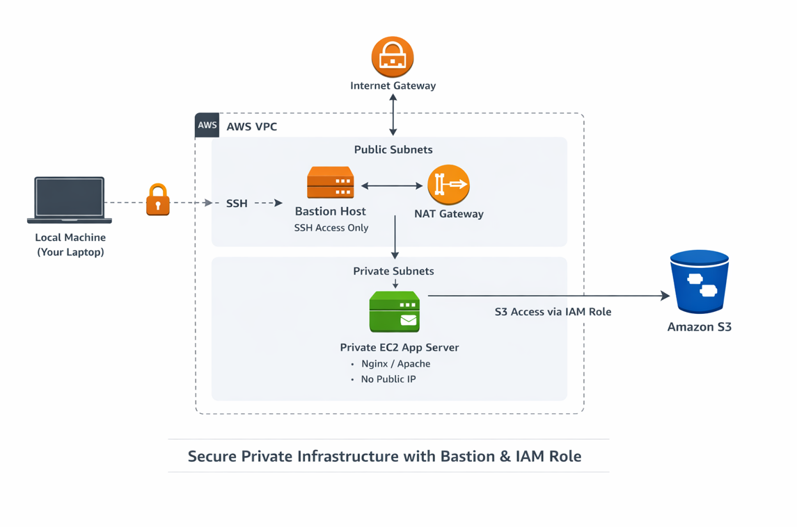
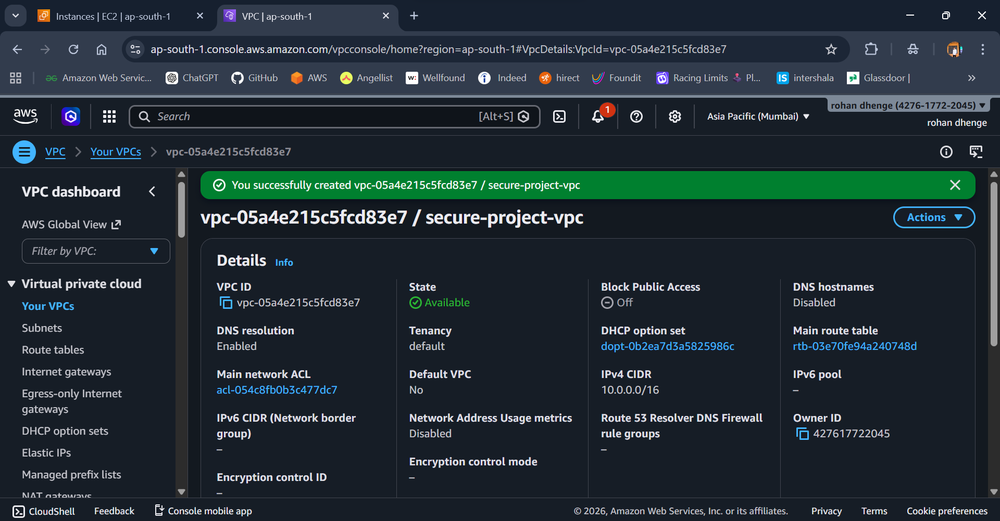
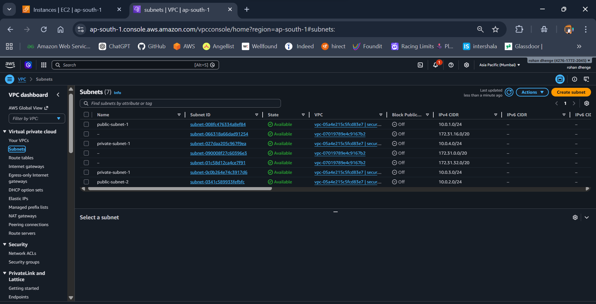
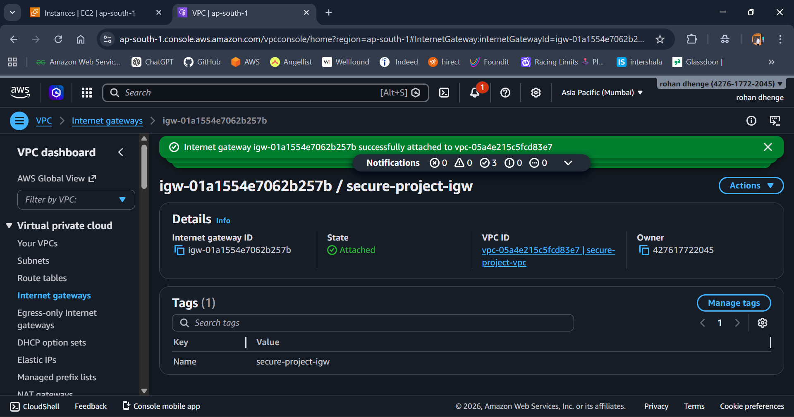
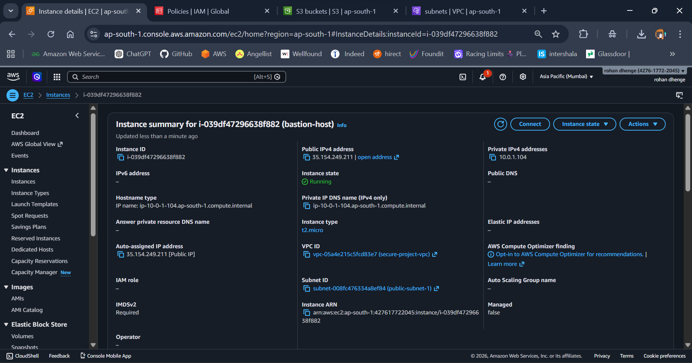
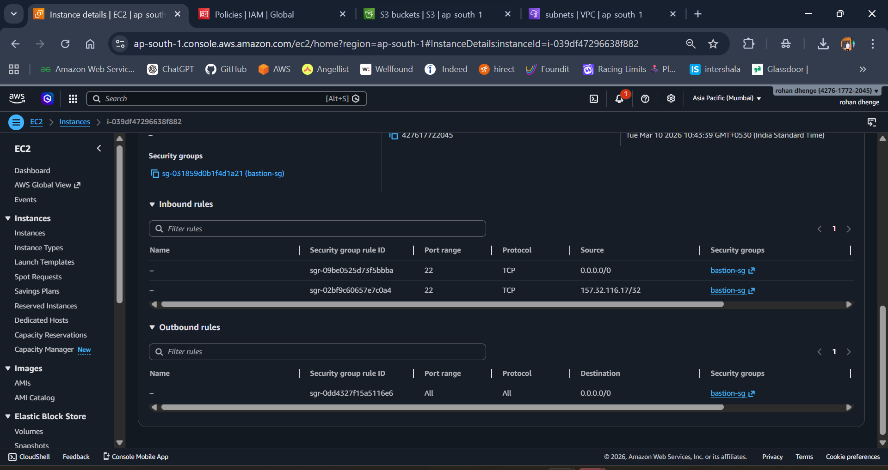
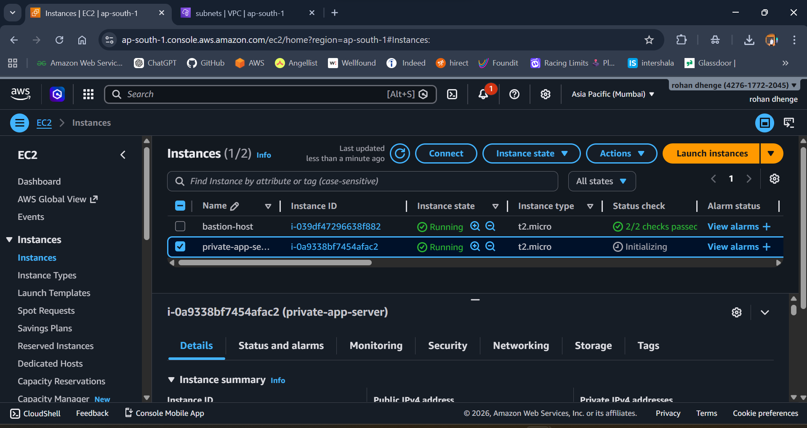

# FinTech Cloud Infrastructure Project (AWS)

## Overview

This project demonstrates a **secure cloud architecture for a FinTech application** using AWS services.
The infrastructure follows **DevOps and cloud security best practices**, including private networking, bastion access, and IAM role-based authentication.

The goal is to deploy a web application on a **private EC2 instance** while allowing secure administrative access and controlled service permissions.

---

# Architecture Components



## 1. VPC Network Setup

A custom **Virtual Private Cloud (VPC)** was created to isolate the infrastructure.

# Overview Of Architecture


Architecture Explanation

The infrastructure is designed to provide a secure, production-grade AWS environment following the principle of least privilege and network isolation. The main goal is to prevent direct internet exposure of application servers while allowing controlled access through a Bastion Host.

1. VPC and Subnets

* A custom VPC is created to isolate resources from other AWS accounts.

* Two public subnets host the Bastion Host and NAT Gateway, while two private subnets host the application servers.

* Public subnets are assigned routing via Internet Gateway (IGW) to allow SSH access from approved IPs.

* Private subnets route internet-bound traffic through the NAT Gateway for updates without exposing the servers publicly.

2. Bastion Host

* The Bastion Host is deployed in a public subnet and acts as the only SSH entry point for developers.

* Access is restricted to a specific IP using security groups.

* Key-based authentication is enforced, and password login is disabled to prevent unauthorized access.

3. Private Application Server

* EC2 instances are launched in private subnets with no public IP, ensuring they cannot be accessed directly from the internet.

* A sample web application is deployed using Nginx or Apache.

* Developers access these servers only through the Bastion Host, enforcing a secure hop.

4. IAM Role

* An IAM role with limited S3 read permissions is attached to the private EC2 instances.

* This allows the application servers to access S3 buckets without storing credentials locally, improving security and adhering to AWS best practices.

5. Security and Access Flow

* Local Machine → Bastion Host → Private EC2 → S3

* Security groups and routing tables ensure that all access follows least privilege principles.

* Private servers cannot be reached directly from the internet, and outbound traffic is controlled via NAT Gateway.


**Configuration**

* Custom VPC




* Public Subnet
* Private Subnet




* Internet Gateway



* NAT Gateway


* Route Tables with proper associations


**Purpose**

* Public subnet is used for the Bastion host.
* Private subnet is used for the application server.

---

# 2. Bastion Host (Secure SSH Access)

A **Bastion Host EC2 instance** was deployed in the public subnet.


**Features**

* Allows secure SSH access to the private server
* Acts as a gateway for administrators
* Prevents direct public access to private infrastructure


**Security**

* SSH allowed only from trusted IP
* Private EC2 accessible only through Bastion host




---

# 3. Private Application Server

A second **EC2 instance was launched in the private subnet**.




**Configuration**

* No public IP
* Accessible only through Bastion host
* Nginx installed as web server

**Deployment**

* Custom HTML page deployed inside:

```
/usr/share/nginx/html
```

Server verification:

```
curl localhost
```

---

# 4. IAM Role Implementation

To follow AWS security best practices, **IAM Role-based authentication** was implemented.

## IAM Role Created

```
fintech-ec2-s3-read-role
```


**Permissions**

* AmazonS3ReadOnlyAccess

**Attached To**

* Private EC2 instance


## Purpose

Allows the server to access S3 **without storing AWS access keys on the instance**.

Verification:

```
aws s3 ls
```

No credentials stored on server:

```
~/.aws/credentials
```

---

# 5. Amazon S3 Integration

An **Amazon S3 bucket** is used for secure object storage.

**Use cases**

* Application assets
* Backup storage
* Logs
* Static files

Because the EC2 instance uses an **IAM Role**, it can securely access the bucket without manual credentials.

---

# Security Best Practices Implemented

* Private EC2 without public IP
* Bastion host for controlled access
* IAM role instead of access keys
* Network isolation using VPC
* Secure SSH authentication using key pair
* Limited S3 read permissions

---

# Project Outcome

This project demonstrates a **production-style cloud infrastructure** commonly used in FinTech environments where security and controlled access are critical.

# Lessons Learned

Network isolation is critical for securing sensitive resources.

Bastion hosts simplify controlled access management.

IAM roles are safer and more maintainable than static credentials.

Proper security group design enforces least privilege access.

Routing via NAT allows private instances to stay secure while maintaining functionality.

---

# Security Design Decisions

1.Private subnets protect application servers from public exposure.

2.Bastion Host as the single entry point for SSH.

3.Key-based authentication & IP restriction enhance security.

4.IAM roles eliminate hardcoded credentials and follow least privilege.

5.Strict security group rules limit open ports.

6.NAT Gateway enables secure outbound traffic for updates.

# Technologies Used

* AWS EC2
* AWS VPC
* AWS IAM
* Amazon S3
* Nginx
* Linux
* SSH
